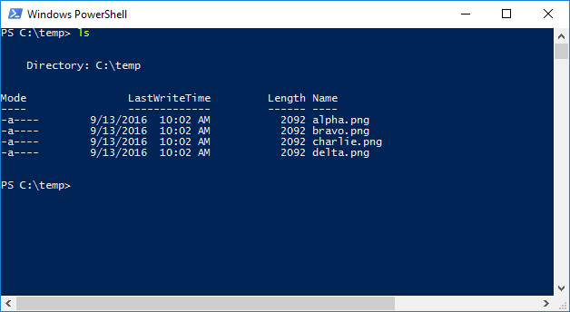
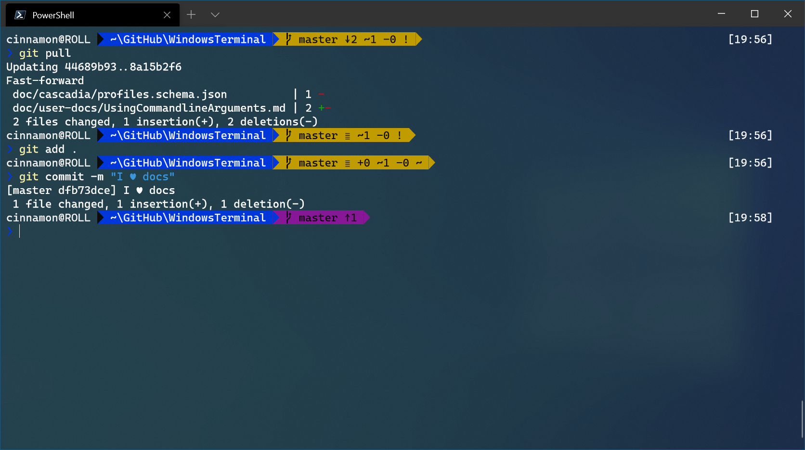

## 🤔Windows에서 PowerShell과 Git Bash가 너무 밋밋해!

개발을 할 때 Terminal은 거의 필수적으로 사용하게 된다.<br />
평소에는 별 신경 안썼지만, 인터넷을 돌아다니면 보이는 Terminal 캡쳐 화면이 나의 PowerShell 과는 다른 **특별한** PowerShell 또는 Git Bash가 보이는 것이 아닌가!<br />
조금 검색해 보니 바로 `zsh`라는 녀석을 적용시킨 것이었다.




## `zsh` 그래서 장점이 뭔데 😮

찾아보면 여러 장점이 나오지만 가장 크게 체감된 것은 두 가지다.
> 1. 이쁘다!
> 2. 넓은 플러그인 생태계
> 3. git 상태를 한눈에 확인하기 좋다.

#### 1. 이쁘다!

가장 체감이 많이 되고 큰 장점이라고 생각한다. ~~사실 가장 큰 이유~~

#### 2. 넓은 플러그인 생태계

다양한 플러그인들이 있어서 필요한 기능을 추가해 커스터마이즈해 사용할 수 있다.<br />
[Google 에서 `zsh` 플러그인들을 찾아 설치해 보도록 하자.]( https://www.google.com/search?q=zsh+%ED%94%8C%EB%9F%AC%EA%B7%B8%EC%9D%B8 )

#### 3. git 상태를 한눈에 확인하기 좋다.

현재 branch 위치나 repo의 status까지 표시해 주니 매번 `git status` 명령어를 사용하지 않아도 돼 몹시 편했다!

## `zsh` Windows 10 에서 설치하기 🔨

나는 개발할 때 `PowerShell`과 `Git Bash`를 나름의 규칙에 따라 섞어 사용하기 때문에 각각 `zsh` 를 설치해야 했다.<br />
1. ###`PowerShell`에 설치하기
> 1. 관리자 권한으로 `PowerShell` 실행
> 2. oh-my-posh 설치
> ```bash
> Install-Module posh-git -Scope CurrentUser 
> Install-Module oh-my-posh -Scope CurrentUser
> ```
> 3. `PowerShell` 스크립트 허용
> ```bash
> Set-ExecutionPolicy Unrestricted
> # 스크립트 상태 확인
> ExecutionPolicy
> # echo Unrestricted 일 때 정상
> ```
> 4. `PowerShell` 프로파일 수정
> ```bash
> notepad $PROFILE
> ```
> > ```bash
> > # Microsoft.PowerShell_profile.ps1 수정 후 저장
> > Import-Module posh-git
> > Import-Module oh-my-posh
> > Set-PoshPrompt -Theme agnoster
> >```
> 5. `PowerShell` 재시작

`PowerShell`의 경우 `oh-my-posh`를 이용해 `zsh`를 사용할 수 있다.<br />
ms에서 공식 지원하는 것으로 보이는데, 때문에 linux나 macOS에서 사용하는 `oh-my-zsh`보다 플러그인이 적은 느낌이다.<br />

2. ### `Git Bash`에 설치하기
> 1. [`zsh` 패키지 다운로드](https://packages.msys2.org/package/zsh?repo=msys&variant=x86_64)
> 2. 다운로드한 `zsh-5.8-5-x86_64.pkg.tar.zst` 파일을 압축을 풀고 `zsh-5.8-5-x86_64.pkg.tar` 파일을 실행시켜 파일들을 `Git` 설치폴더에 복사 (`C:\Program Files\Git`)
> 3. 명령어를 입력해 정상 작동하는지 확인
> ```bash
> zsh
> # 정상 작동시 q로 작업 취소
> # 작동 실패시 경로상 영어가 아닌 특수문자가 있는지 확인
> ```
> 4. `oh-my-zsh` 설치
> ```bash
> sh -c "$(curl -fsSL https://raw.githubusercontent.com/robbyrussell/oh-my-zsh/master/tools/install.sh)"
> ```
> 5. `~/.bashrc` 수정
> ```bash
> vim ~/.bashrc
> ## 아래 내용을 그대로 ~/.bashrc 파일 마지막에 추가합니다. 
> # Launch Zsh
> if [ -t 1 ]; then
>   exec zsh
> fi
> ```
> 6. `Git Bash` 재시작
> > 재시작시 `.bashrc` 로딩에 오류가 발생하면 [여기](https://superuser.com/questions/602872/how-do-i-modify-my-git-bash-profile-in-windows )를 참고해 수정하자.
> 7. 플러그인 설치
> > 나는 두가지 플러그인을 설치했다.
> > ```bash
> > # zsh-syntax-highlighting
> > git clone https://github.com/zsh-users/zsh-syntax-highlighting.git ${ZSH_CUSTOM:-~/.oh-my-zsh/custom}/plugins/zsh-syntax-highlighting
> >
> > # zsh-autosuggestions
> > git clone git://github.com/zsh-users/zsh-autosuggestions $ZSH_CUSTOM/plugins/zsh-autosuggestions
> > ```
> > 명령이 완료되면 ~/.zshrc를 수정하자.
> > ```bash
> > vim ~/.zshrc
> > ## .zshrc 파일의 끝에 아래 내용을 추가
> > plugins=(
> >   git
> >   zsh-syntax-highlighting
> >   zsh-autosuggestions
> > )
> > ```
> > `source ~/.zshrc` 명령어 입력.

## 마치며
`zsh`를 설치한다고 해서 개발이 잘 되거나 그런 것은 아니지만, 편의성과 UI를 챙기면서 약간의 기분전환도 가능했다.<br />
내일은 오늘보더 더 코딩이 잘 될지도? 이런데 시간을 쏟은게 싫지만은 않은 느낌?

---

### 참고 링크
> https://docs.microsoft.com/en-us/windows/terminal/tutorials/powerline-setup <br/>
> https://gist.github.com/fworks/af4c896c9de47d827d4caa6fd7154b6b
